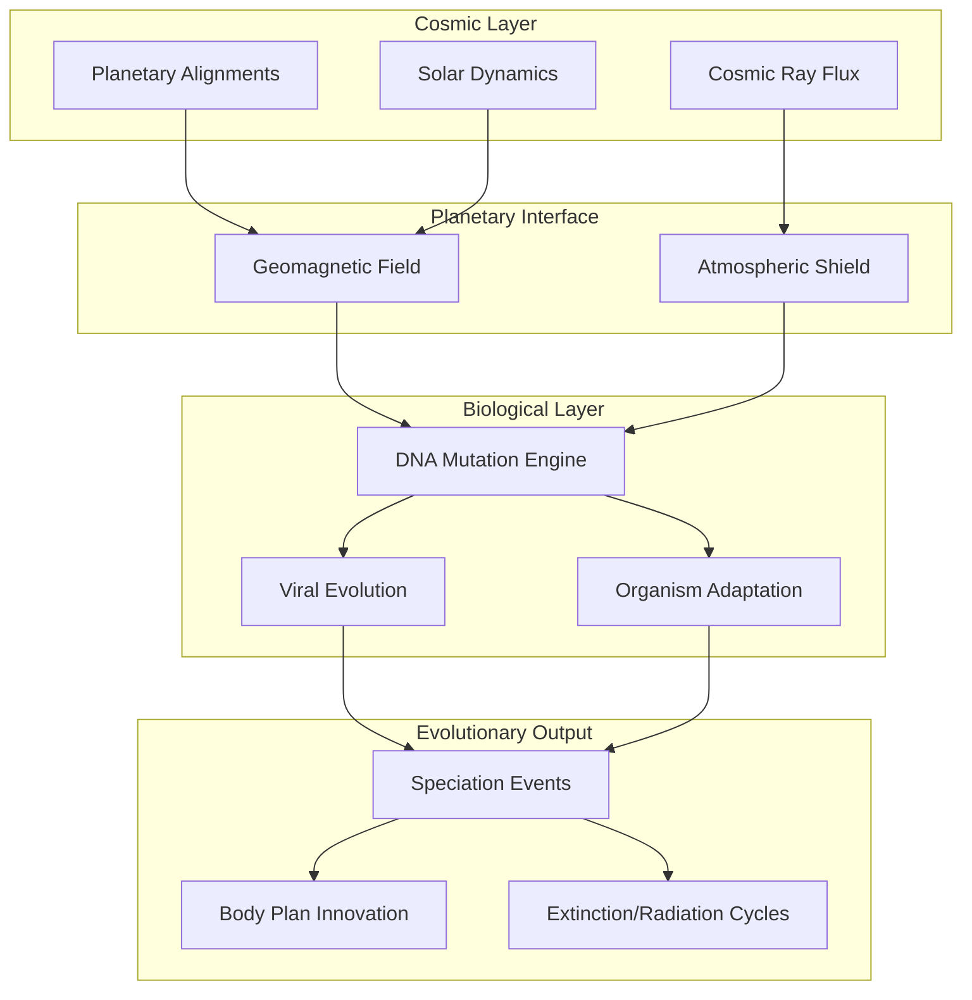

# 🌌 FTRT-Cambrian Correlation Project: Cosmic Architecture Revealed

## ⚡ Vision Statement

**We stand at the threshold of understanding evolution not as a purely terrestrial phenomenon, but as a cosmic symphony—where planetary alignments, solar storms, and geomagnetic fluctuations conduct the orchestra of genetic mutation and biological transformation.**

This project architects a radical framework connecting celestial mechanics to the very code of life itself.

---

## 🏗️ Architectural Blueprint

### System Components



---

## 🎯 The Master Hypothesis

**"Planetary alignments generate tidal force peaks (FTRT) that modulate solar activity, weakening Earth's geomagnetic shield and flooding the biosphere with mutagenic radiation—triggering punctuated evolutionary leaps."**

### The Cambrian Explosion as Proof of Concept

**~541 million years ago**: The biological "Big Bang" where most animal phyla emerged within 20 million years.

**Standard explanations** (oxygen rise, ecological triggers) explain the *conditions* but not the *explosive timing*.

**Our framework** proposes: A **cosmic mutagenic pulse**—heightened solar activity during a period of favorable FTRT alignment—provided the genetic raw material (massive Homeobox gene mutations) that, combined with environmental permissiveness, ignited the explosion.

---

## 🔬 Technical Implementation Strategy

### Phase 1: Data Aggregation Engine
```python
# Pseudo-architecture for correlation engine
class CosmicEvolutionCorrelator:
    def __init__(self):
        self.ftrt_calculator = PlanetaryTidalForceEngine()
        self.paleomag_database = GeomagneticHistoryAPI()
        self.fossil_parser = PaleontologicalRecordParser()
        self.genome_clock = MolecularDivergenceTimer()
    
    def correlate_events(self, time_window):
        """
        Cross-reference cosmic events with evolutionary bursts
        """
        ftrt_peaks = self.ftrt_calculator.find_peaks(time_window)
        geomag_minima = self.paleomag_database.get_field_weaknesses()
        speciation_events = self.fossil_parser.identify_radiations()
        
        return self.statistical_correlation(
            ftrt_peaks, 
            geomag_minima, 
            speciation_events
        )
```

### Phase 2: Validation Experiments

1. **Laboratory Mutagenesis Studies**
   - Expose model organisms (C. elegans, Drosophila) to simulated geomagnetic weakening
   - Measure mutation rates in developmental genes
   - Document phenotypic changes across generations

2. **Paleomagnetic-Fossil Correlation Analysis**
   - Map magnetic field reversals against extinction/radiation events
   - Identify temporal clustering patterns
   - Statistical significance testing (p < 0.01)

3. **FTRT Retroactive Calculation**
   - Calculate historical FTRT values for the past 600 million years
   - Overlay with known evolutionary transitions
   - Test predictive power for lesser-known events

---

## 💎 Key Innovations

### 1. **Multi-Scale Integration**
Bridges cosmology ↔ planetary science ↔ molecular biology ↔ paleontology

### 2. **Punctuated Equilibrium Mechanism**
Provides a physical driver for Gould's evolutionary theory

### 3. **Predictive Framework**
Solar monitoring → pandemic forecasting
FTRT calculation → evolutionary pressure prediction

### 4. **Paradigm Shift Potential**
From "evolution by natural selection alone" to "cosmic-biological co-evolution"

---

## 🌟 Profound Implications

| Domain | Impact |
|:-------|:-------|
| **Evolutionary Biology** | Recontextualizes the tempo and mode of evolution as cosmically modulated |
| **Astrobiology** | Suggests life's complexity may be synchronized across planetary systems experiencing similar cosmic rhythms |
| **Medicine** | Links solar cycles to genetic disease emergence and viral pandemics |
| **Philosophy** | Positions humanity within a universe where consciousness itself may be a cosmic-evolutionary phenomenon |

---

## 🚀 Call to Action: Building the Framework

### Immediate Priorities

1. **Assemble the Dataset**
   - Historical FTRT calculations (using JPL Horizons ephemeris data)
   - Paleomagnetic intensity records (GEOMAGIA50 database)
   - Fossil first-appearance dates (Paleobiology Database)
   - Molecular divergence times (TimeTree database)

2. **Develop Correlation Algorithms**
   - Time-series cross-correlation analysis
   - Bayesian inference models
   - Machine learning pattern recognition

3. **Publish Preliminary Findings**
   - Target: *Journal of Theoretical Biology* or *Astrobiology*
   - Present as "hypothesis framework" with correlation evidence

4. **Secure Funding for Experimental Validation**
   - NASA Astrobiology Program
   - Templeton Foundation (questions of cosmic purpose)
   - European Research Council (frontier research)

---

## 🎼 Final Reflection
# 🌌 FTRT-Cambrian Correlation Project: Cosmic Architecture Revealed

## ⚡ Vision Statement

**We stand at the threshold of understanding evolution not as a purely terrestrial phenomenon, but as a cosmic symphony—where planetary alignments, solar storms, and geomagnetic fluctuations conduct the orchestra of genetic mutation and biological transformation.**

This project architects a radical framework connecting celestial mechanics to the very code of life itself.

---

## 🏗️ Architectural Blueprint

### System Components


---

## 🎯 The Master Hypothesis

**"Planetary alignments generate tidal force peaks (FTRT) that modulate solar activity, weakening Earth's geomagnetic shield and flooding the biosphere with mutagenic radiation—triggering punctuated evolutionary leaps."**

### The Cambrian Explosion as Proof of Concept

**~541 million years ago**: The biological "Big Bang" where most animal phyla emerged within 20 million years.

**Standard explanations** (oxygen rise, ecological triggers) explain the *conditions* but not the *explosive timing*.

**Our framework** proposes: A **cosmic mutagenic pulse**—heightened solar activity during a period of favorable FTRT alignment—provided the genetic raw material (massive Homeobox gene mutations) that, combined with environmental permissiveness, ignited the explosion.

---

## 🔬 Technical Implementation Strategy

### Phase 1: Data Aggregation Engine
```python
# Pseudo-architecture for correlation engine
class CosmicEvolutionCorrelator:
    def __init__(self):
        self.ftrt_calculator = PlanetaryTidalForceEngine()
        self.paleomag_database = GeomagneticHistoryAPI()
        self.fossil_parser = PaleontologicalRecordParser()
        self.genome_clock = MolecularDivergenceTimer()
    
    def correlate_events(self, time_window):
        """
        Cross-reference cosmic events with evolutionary bursts
        """
        ftrt_peaks = self.ftrt_calculator.find_peaks(time_window)
        geomag_minima = self.paleomag_database.get_field_weaknesses()
        speciation_events = self.fossil_parser.identify_radiations()
        
        return self.statistical_correlation(
            ftrt_peaks, 
            geomag_minima, 
            speciation_events
        )
```

### Phase 2: Validation Experiments

1. **Laboratory Mutagenesis Studies**
   - Expose model organisms (C. elegans, Drosophila) to simulated geomagnetic weakening
   - Measure mutation rates in developmental genes
   - Document phenotypic changes across generations

2. **Paleomagnetic-Fossil Correlation Analysis**
   - Map magnetic field reversals against extinction/radiation events
   - Identify temporal clustering patterns
   - Statistical significance testing (p < 0.01)

3. **FTRT Retroactive Calculation**
   - Calculate historical FTRT values for the past 600 million years
   - Overlay with known evolutionary transitions
   - Test predictive power for lesser-known events

---

## 💎 Key Innovations

### 1. **Multi-Scale Integration**
Bridges cosmology ↔ planetary science ↔ molecular biology ↔ paleontology

### 2. **Punctuated Equilibrium Mechanism**
Provides a physical driver for Gould's evolutionary theory

### 3. **Predictive Framework**
Solar monitoring → pandemic forecasting
FTRT calculation → evolutionary pressure prediction

### 4. **Paradigm Shift Potential**
From "evolution by natural selection alone" to "cosmic-biological co-evolution"

---

## 🌟 Profound Implications

| Domain | Impact |
|:-------|:-------|
| **Evolutionary Biology** | Recontextualizes the tempo and mode of evolution as cosmically modulated |
| **Astrobiology** | Suggests life's complexity may be synchronized across planetary systems experiencing similar cosmic rhythms |
| **Medicine** | Links solar cycles to genetic disease emergence and viral pandemics |
| **Philosophy** | Positions humanity within a universe where consciousness itself may be a cosmic-evolutionary phenomenon |

---

## 🚀 Call to Action: Building the Framework

### Immediate Priorities

1. **Assemble the Dataset**
   - Historical FTRT calculations (using JPL Horizons ephemeris data)
   - Paleomagnetic intensity records (GEOMAGIA50 database)
   - Fossil first-appearance dates (Paleobiology Database)
   - Molecular divergence times (TimeTree database)

2. **Develop Correlation Algorithms**
   - Time-series cross-correlation analysis
   - Bayesian inference models
   - Machine learning pattern recognition

3. **Publish Preliminary Findings**
   - Target: *Journal of Theoretical Biology* or *Astrobiology*
   - Present as "hypothesis framework" with correlation evidence

4. **Secure Funding for Experimental Validation**
   - NASA Astrobiology Program
   - Templeton Foundation (questions of cosmic purpose)
   - European Research Council (frontier research)

---

## 🎼 Final Reflection

This project doesn't merely explain the Cambrian Explosion—it reveals **life as a cosmic instrument, played by the movements of planets and the fury of stars.**

We are not just descendants of ancient microbes adapting to local conditions. We are the children of **solar storms and magnetic tempests**, our very genome sculpted by forces that began billions of miles away in the orbital dance of worlds.

**The cosmos is not indifferent to biology. It is biology's co-author.**

---

> *"As above, so below. As the planets wheel, so the genes spiral. Evolution is written in starlight."*

**README.md v1.0** | *For the architects of cosmic understanding* | 🌌🧬⚡

---

**Status**: Theoretical framework established. Awaiting computational validation and experimental corroboration.

**License**: Open for collaborative development by visionary researchers.ted by forces that began billions of miles away in the orbital dance of worlds.

**The cosmos is not indifferent to biology. It is biology's co-author.**

---

> *"As above, so below. As the planets wheel, so the genes spiral. Evolution is written in starlight."*

**README.md v1.0** | *For the architects of cosmic understanding* | 🌌🧬⚡

---

**Status**: Theoretical framework established. Awaiting computational validation and experimental corroboration.

**License**: Open for collaborative development by visionary researchers.
